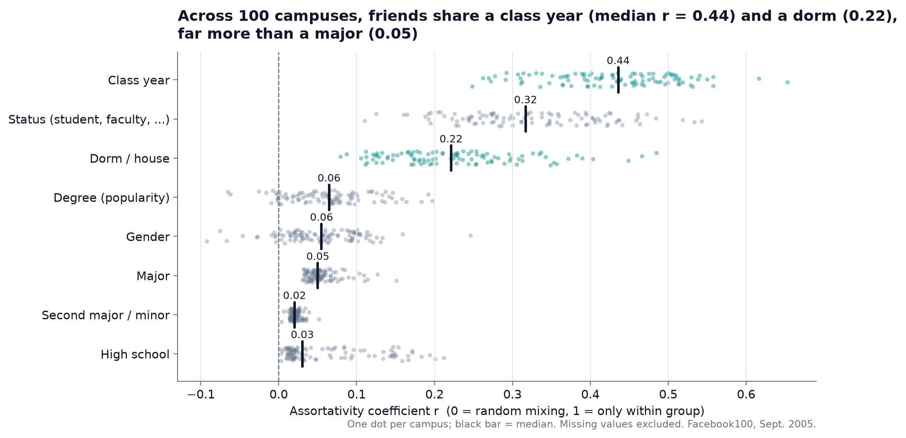
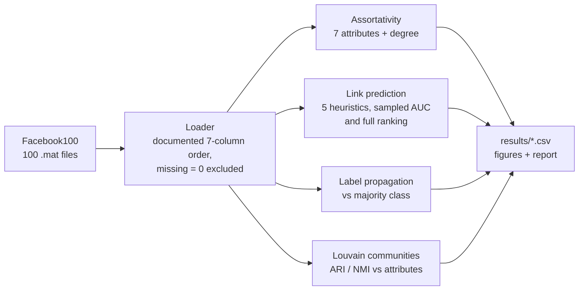
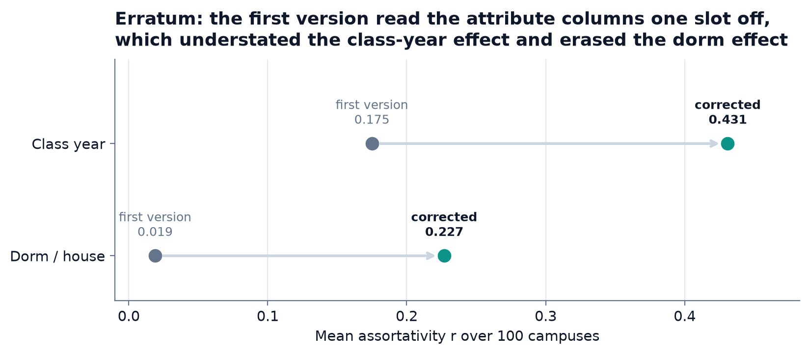
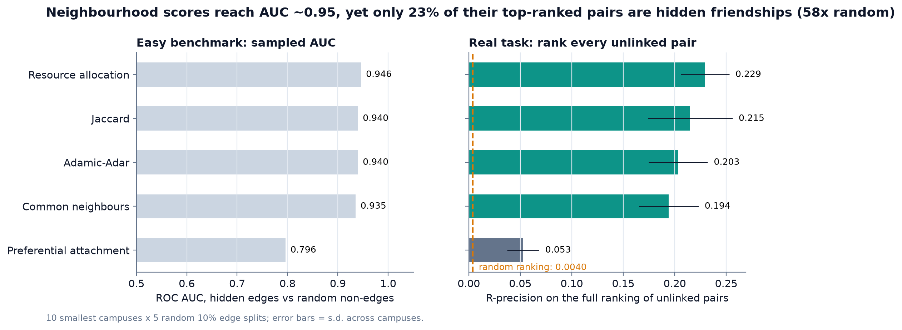
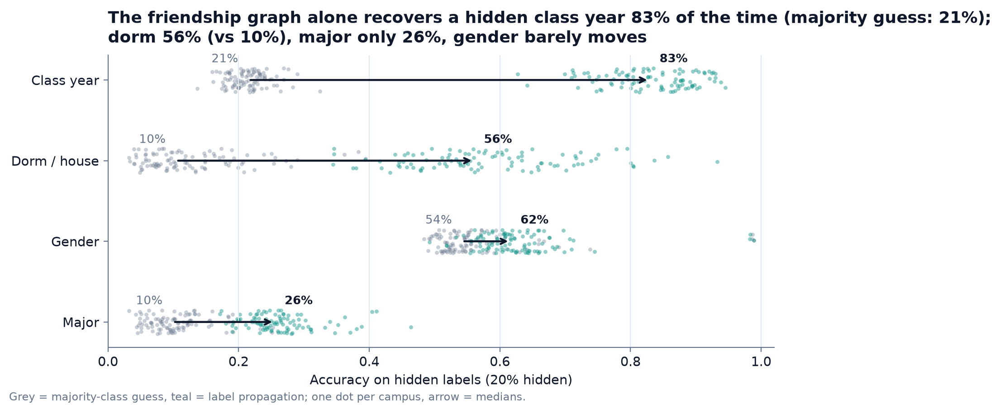
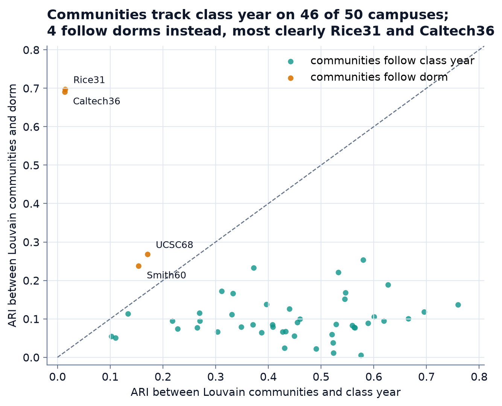
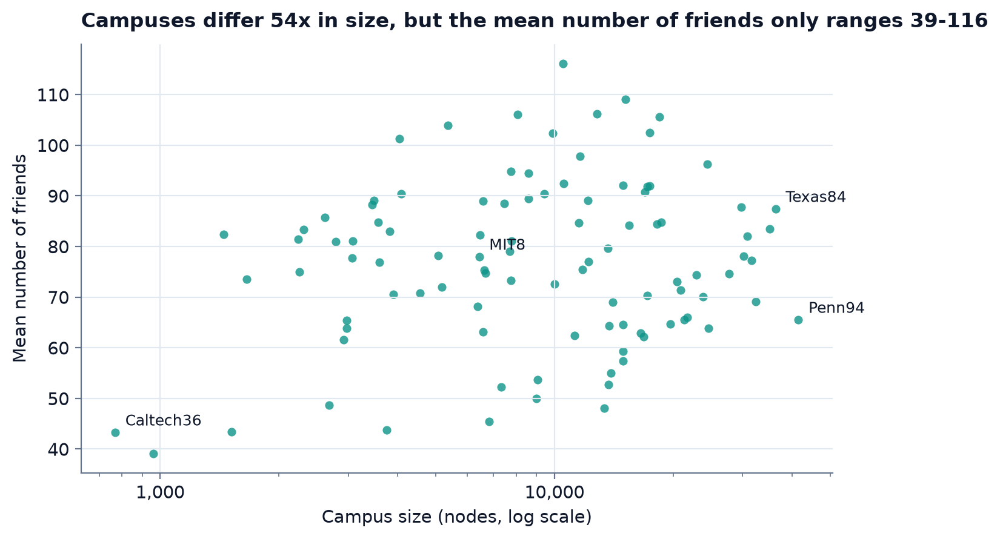

# facebook100-social-structure

**What organises friendship on a college campus?** Homophily, link prediction, label
propagation and community detection on all 100 Facebook100 campus networks
(1.2 million accounts, 47 million friendships), with honest baselines and a documented
correction of this project's first version.

[](https://github.com/Pchambet/facebook100-social-structure/actions/workflows/ci.yml)

[](LICENSE)
[](https://pchambet.github.io/facebook100-social-structure/)



## TL;DR

- **Class year is the main organiser of campus friendship**: it is the most assortative
  attribute on 91 of 100 campuses. Median r over campuses: class year 0.436, status 0.317,
  dorm 0.221; major (0.050), gender (0.055) and high school (0.030) barely matter.
- **Erratum.** The first version of this project read the attribute columns one slot off
  (its "year" was the dorm, its "dorm" the second major) and counted missing values as a
  category. Its notebook and report found a dorm effect of 0.019 and concluded that dorms
  do not matter (its README, contradicting both, said dorms drive friendships). As means
  over 100 campuses: with the documented column order the dorm effect is 0.175, and with
  missing values excluded it is 0.227.
- **Link prediction looks solved and is not.** Common-neighbour scores reach a sampled AUC
  of 0.935-0.946 (10 smallest campuses), yet when every unlinked pair is ranked, only 23% of
  the top-ranked pairs are hidden friendships (resource allocation, R-precision): 58 times
  the 0.4% base rate, and still wrong about four times in five.
- **The graph alone recovers a hidden class year 83% of the time** (median over 100
  campuses; always guessing the most frequent year: 21%) and a hidden dorm 56% of the time
  (10%). For gender it adds 7 points over the majority guess.
- **Louvain communities follow class year on 46 of 50 campuses.** The exceptions follow
  residence: Rice (ARI 0.70 with dorm) and Caltech (0.69), the case highlighted by
  Traud et al., then UCSC and Smith.

## Why it matters

Recommendation ("people you may know"), attribute inference and targeting all lean on
homophily. Knowing *which* attribute structures a network decides what a model can infer,
and how much: here class year is nearly free to infer, gender is not. The link-prediction
results carry a broader lesson: a benchmark against random negatives can report AUC 0.95
for a ranking in which about four of five pairs in the top-R list (R = the number of hidden
friendships) are wrong.

## Approach



1. **Data**: the 100 school files, each a sparse adjacency matrix plus seven node
   attributes (status, gender, major, minor, dorm, year, high school; 0 = missing).
2. **Homophily**: Newman's assortativity coefficient per attribute, computed on edges whose
   two endpoints are labelled.
3. **Link prediction**: hide 10% of edges; score pairs with common neighbours, Jaccard,
   Adamic-Adar, resource allocation and preferential attachment; evaluate against random
   non-edges (sampled AUC: median 0.96-0.97 for the common-neighbour scores over all 100
   campuses; the README quotes the 10 smallest campuses, like for like with the full
   ranking) and on the full ranking of unlinked pairs (precision@k, R-precision, 10 smallest
   campuses x 5 splits).
4. **Label propagation**: harmonic propagation (Zhu et al., 2003) with 20% of known labels
   hidden, against the majority-class guess.
5. **Communities**: Louvain (campuses up to 10,000 nodes), compared with each attribute by
   adjusted Rand index.

Sparse linear algebra throughout (chunked triangle counts, vectorised scores), so the
1.6-million-edge campuses run on a laptop.

## Results



Reading the documented column order and excluding missing values changes the conclusion:
dorms matter, and class year matters about twice as much as dorms. The column shift is the
larger error; counting missing values as a category cost another 0.05-0.08 in r. `make run`
reproduces the first version exactly and fixes one error at a time (`* (legacy label)` and
`* (missing counted)` rows in `results/assortativity.csv`).



| Method | Sampled AUC | Precision@100 | R-precision | Average precision |
|---|---:|---:|---:|---:|
| Resource allocation | 0.946 | 0.58 | 0.229 | 0.153 |
| Jaccard | 0.940 | 0.53 | 0.215 | 0.139 |
| Adamic-Adar | 0.940 | 0.61 | 0.203 | 0.134 |
| Common neighbours | 0.935 | 0.60 | 0.194 | 0.121 |
| Preferential attachment | 0.796 | 0.14 | 0.053 | 0.021 |

Mean over the 10 smallest campuses x 5 random splits; base rate of the full ranking 0.4%.
Precision@k is the expectation over random tie-breaking (scores are heavily tied).
The first version's 96% precision@100 for Adamic-Adar came from ranking hidden edges against
ten times as many random non-edges (12 smallest campuses); on the full ranking it is 61%.



Class year is largely recoverable from the graph (83%), dorm about half the time (56% vs
10%); major only partly (26%) and gender barely (+7 points over the majority guess), in line
with their weak assortativity (medians over 100 campuses).



On 4 of the 50 campuses analysed (Rice, Caltech, UCSC, Smith, all with residential
colleges or houses) communities follow residence; on the other 46, class year.



Mean degree ranges 39-116 while size ranges 769-41,554, so density falls almost exactly
with size (correlation of logs -0.97). Transitivity (median 0.158) stays about 19 times the
density: clustered, not random.

The [online report](https://pchambet.github.io/facebook100-social-structure/) has interactive
versions of every chart (hover for each campus).

## Reproduce

```bash
make setup    # uv sync --locked (Python 3.12)
make data     # downloads facebook100.zip (207 MB) from the Internet Archive, checks its MD5
make run      # every analysis on the 100 campuses -> results/
make report   # docs/figures/*.png and site/index.html
```

`make run` took 45 min wall-clock (27 CPU-minutes) with 3 worker processes on a shared,
heavily loaded 10-core laptop. The extracted data takes 201 MB.
`make test` runs the unit tests (no data needed); `make notebook` re-executes the Caltech
walkthrough in [`notebooks/analysis.ipynb`](notebooks/analysis.ipynb).

## Repository layout

```
src/fb100/
  io.py            loader: sparse adjacency + named attribute columns
  data.py          checksum-verified, idempotent download
  structure.py     degree, density, triangles, clustering (sparse, chunked)
  homophily.py     attribute assortativity with missing values excluded
  linkpred.py      heuristics, edge splits, sampled AUC, full-ranking precision
  labelprop.py     harmonic label propagation
  communities.py   Louvain + ARI / NMI against attributes
  pipeline.py      end-to-end run and headline summary
  figures.py       static figures
  report.py        static HTML report
tests/             unit tests, incl. ground-truth recovery on planted partitions
results/           result tables and summary.json (committed, 240 KB)
docs/figures/      README figures
site/index.html    report page (GitHub Pages)
notebooks/         Caltech walkthrough
data/README.md     data source and terms (the data itself is not committed)
```

## Methodology notes and limitations

- **One snapshot.** September 2005, intra-school links only. Attributes are self-reported
  and partly missing (e.g. 22% of dorms at Caltech); missing values are excluded per
  attribute, which assumes they are missing at random.
- **Association, not cause.** Assortativity does not separate choosing similar friends from
  sharing a context (same dorm, same classes). Status codes are not documented beyond
  "student/faculty flag", so the status result is reported but not interpreted.
- **Random edge removal** is easier than predicting future ties, and no supervised model is
  trained: the heuristics are unsupervised baselines. Full-ranking metrics are computed only
  on the 10 smallest campuses (dense n x n score matrices).
- **Label propagation** uses one random 20% split per campus. On the 10 smallest campuses
  (`results/labelprop_curve.csv`, 3 seeds) accuracy degrades gracefully as more labels are
  hidden (class year, median over 30 runs: 88% with 10% hidden, 64% with 90% hidden) and
  the median seed-to-seed standard deviation is 2 points.
- **Louvain** is run once (seed 0) and only on the 50 campuses with at most 10,000 nodes.
- **Data ethics.** The dataset describes real people. It is analysed only in aggregate and
  is no longer stored in this repository: the files were removed from the tree in
  October 2026, but the earlier commits still contain them. See
  [`data/README.md`](data/README.md).

This started as a course project (NET 4103/7431, Telecom SudParis, January 2026) with
Lilian Marthiens; the original French report is kept in
[`docs/coursework-report-fr.pdf`](docs/coursework-report-fr.pdf). It predates the
correction above, so its assortativity, label-propagation and community conclusions are
superseded by this README.

## References

- A. L. Traud, P. J. Mucha, M. A. Porter. *Social Structure of Facebook Networks*.
  Physica A 391(16), 4165-4180 (2012). [arXiv:1102.2166](https://arxiv.org/abs/1102.2166)
- A. L. Traud, E. D. Kelsic, P. J. Mucha, M. A. Porter. *Comparing Community Structure to
  Characteristics in Online Collegiate Social Networks*. SIAM Review 53(3), 526-543 (2011).
- M. E. J. Newman. *Mixing patterns in networks*. Physical Review E 67, 026126 (2003).
- D. Liben-Nowell, J. Kleinberg. *The link-prediction problem for social networks*.
  JASIST 58(7), 1019-1031 (2007).
- T. Zhou, L. Lü, Y.-C. Zhang. *Predicting missing links via local information*.
  European Physical Journal B 71, 623-630 (2009).
- X. Zhu, Z. Ghahramani, J. Lafferty. *Semi-supervised learning using Gaussian fields and
  harmonic functions*. ICML (2003).
- V. D. Blondel, J.-L. Guillaume, R. Lambiotte, E. Lefebvre. *Fast unfolding of communities
  in large networks*. J. Stat. Mech. P10008 (2008).
- Data: Facebook100, Internet Archive mirror
  <https://archive.org/details/oxford-2005-facebook-matrix>.

---

Built by [Pierre Chambet](https://github.com/Pchambet) — decision science for operations
under uncertainty.
